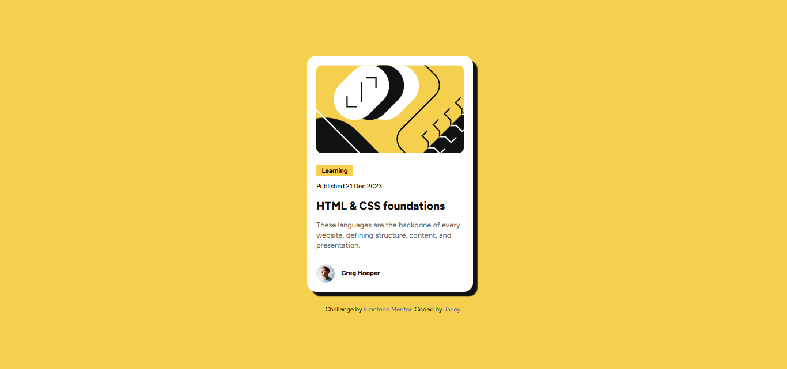

# Frontend Mentor - Blog preview card solution

This is a solution to the [Blog preview card challenge on Frontend Mentor](https://www.frontendmentor.io/challenges/blog-preview-card-ckPaj01IcS). Frontend Mentor challenges help you improve your coding skills by building realistic projects. 

## Table of contents

- [Overview](#overview)
  - [Screenshot](#screenshot)
  - [Links](#links)
- [My process](#my-process)
  - [Built with](#built-with)
  - [What I learned](#what-i-learned)
  - [Continued development](#continued-development)


## Overview

### Screenshot



### Links
- Solution URL: (https://github.com/jacey10/fm-blog-preview-card-challenge.git)
- Live Site URL: ()

## My process

### Built with
- Semantic HTML5 markup
- CSS custom properties
- Flexbox
- Mobile-first workflow


### What I learned
- I had a better understanding of block and inline elements
- I understood the concept of breakpoints, especially, when it comes to writing media queries.
- I learned that flexbox is used for one dimensional layout and it's very flexible/responsive.
- I implemented the mobile first design,before writing media queries for larger screens (i.e. tablets and desktops).
- I struggled in making the Author's name align in the middle or centre of the Author's display picture. Then I decided to try a trick and it worked. The trick was to give both name and image a margin of zero (0).

```css
main {
  margin-inline-end: 0.75rem;
}

.author img, .author p {
  margin: 0;
}
```

### Continued development
- I would continue to explore how to create layouts that are responsive across many screens and devices.


## Author
- Website - [James Chima](https://www.your-site.com)
- Frontend Mentor - [@jacey10](https://www.frontendmentor.io/profile/jacey10)
- Twitter - [@jacey_opara](https://x.com/jacey_opara)


